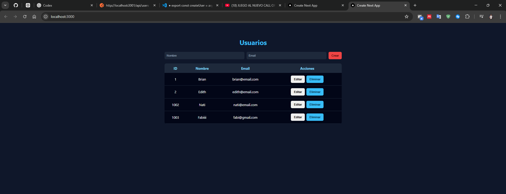

# Next.JS vs Node.JS



Proyecto ejemplo que compara y demuestra una arquitectura Full‑Stack usando:
- Frontend (placeholder): Next.js
- Backend: Node.js con Express y conexión a SQL Server (mssql)

Descripción
-----------
Repositorio de ejemplo para aprender a integrar un backend en Node/Express con una base de datos SQL Server y un posible frontend en Next.js. El backend incluye rutas CRUD básicas para `users` y una configuración de conexión a SQL Server.

Estructura del repositorio
--------------------------

```bash
next-node-project/
│
├── backend/
│   ├── src/
│   │   ├── config/
│   │   │   └── database.js
│   │   ├── routes/
│   │   │   └── users.routes.js
│   │   ├── controllers/
│   │   │   └── users.controller.js
│   │   ├── app.js
│   │   └── server.js
│   └── package.json
│
└── frontend/
    ├── app/page.js
    ├── services/userService.js
```

- `backend/` — Código del servidor (Express)
	- `package.json` — scripts y dependencias
	- `test-db.js` — script de prueba de conexión a DB
	- `src/`
		- `app.js` — inicializa middlewares y rutas
		- `server.js` — punto de entrada (start)
		- `config/database.js` — configuración y helper de conexión (mssql)
		- `controllers/` — controladores (ej. `users.controller.js`)
		- `routes/` — definiciones de rutas (ej. `users.routes.js`)
- `frontend/` — (placeholder) carpeta para Next.js

Requisitos
---------
- Node.js 14+ y npm
- SQL Server accesible desde la máquina donde corre el backend (o Docker con SQL Server)

Configuración
-------------
Actualmente la configuración de base de datos se encuentra en `backend/src/config/database.js` con valores por defecto de ejemplo. En un entorno real mueve esos valores a variables de entorno y modifica `database.js` para leer `process.env`.

Variables recomendadas (ejemplo):
- `DB_USER` — usuario de la base de datos
- `DB_PASSWORD` — contraseña
- `DB_SERVER` — host/servidor
- `DB_NAME` — nombre de la base de datos
- `DB_PORT` — puerto (ej. 1433)
- `PORT` — puerto donde corre la API (ej. 3000)

Instalación y ejecución (backend)
--------------------------------
1. Abrir una terminal en `backend/`

```bash
cd backend
npm install
```

2. Edita `backend/src/config/database.js` para apuntar a tu SQL Server o adapta para usar variables de entorno.

3. Iniciar la API:

```bash
npm start
# o
node src/server.js
```

4. Probar conexión a la base de datos (script de ejemplo):

```bash
node test-db.js
```

Rutas principales (backend)
--------------------------
- `GET /api/users` — lista usuarios (implementado en `users.routes.js` → `getUsers`)
- `POST /api/users` — crear usuario (implementado en `createUser`)

Detalles técnicos importantes
----------------------------
- El backend usa `mssql` para conectarse a SQL Server. Asegúrate de que el servidor SQL permita conexiones desde la máquina donde ejecutas el backend.
- El controlador `createUser` valida `name` y `email` en el cuerpo de la petición; devuelve `400` si faltan.

Desarrollo y mejoras sugeridas
----------------------------
- Mover la configuración sensible a variables de entorno y usar un paquete como `dotenv`.
- Añadir manejo de migraciones/seeders para crear la tabla `users` automáticamente.
- Añadir pruebas unitarias y de integración para las rutas.
- Completar `frontend/` con una app Next.js que consuma la API.

Contribuir
---------
1. Haz un fork y crea una rama con tu mejora.
2. Envía un pull request describiendo los cambios.

Licencia
--------
Este repositorio es un ejemplo; añade la licencia que prefieras si vas a publicar trabajo derivado.

Contacto
--------
Autor: brian-emarquez

---


Pequeños pasos recomendados ahora: revisar y mover credenciales fuera de `database.js`, y decidir si quieres que complete el `frontend/` con un ejemplo básico en Next.js.
