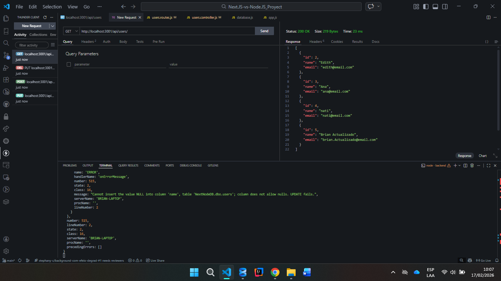

# Backend - Next.JS vs Node.JS Project

API REST desarrollada con **Express.js** conectada a una base de datos **MSSQL**.

## 📋 Requisitos Previos

- **Node.js** 14+ 
- **npm** o **yarn**
- **MSSQL Server** (local o remoto)
- Credenciales de acceso a la base de datos

## 🚀 Instalación

1. **Instalar dependencias:**
```bash
npm install express cors
npm install cors

```

_Permisos PowerShell_

```bash
Set-ExecutionPolicy -ExecutionPolicy RemoteSigned -Scope CurrentUser
```


2. **Ejecutar:**

```bash
npm start
```

3. **Configurar variables de entorno:**
   - Edita `src/config/database.js` con tus credenciales MSSQL
   - Puerto por defecto: `3001`

4. **Test:**

- Diagrama de la API:

  

Prueba los endpoints con los siguientes ejemplos `curl`. Asegúrate de que el servidor esté corriendo en `http://localhost:3001`.

- Obtener todos los usuarios (GET):

```bash
curl -sS http://localhost:3001/api/users | jq
```

- Obtener un usuario por ID (GET):

```bash
POST  http://localhost:3001/api/users/1
```

- Crear un usuario (POST):

```bash
{
  "name": "Brian Actualizado",
  "email": "brian.Actualizado@email.com"
}

```

- Eliminar un usuario (DELETE):

```bash
curl -sS -X DELETE http://localhost:3001/api/users/1
```

Notas:
- Si no tienes `jq`, remueve la tubería `| jq` de los ejemplos o instala `jq` para formatear JSON.
- Asegúrate de enviar `express.json()` (el middleware) activado en `src/app.js` para que POST/PUT funcionen.

## 📁 Estructura del Proyecto

```
backend/
├── src/
│   ├── app.js                    # Configuración de Express
│   ├── server.js                 # Punto de entrada
│   ├── config/
│   │   └── database.js           # Conexión a MSSQL
│   ├── controllers/
│   │   └── users.controller.js   # Lógica de usuarios
│   └── routes/
│       └── users.routes.js       # Rutas de la API
├── db/
│   └── NextNodeDB.sql            # Script de base de datos
├── package.json
└── test-db.js                    # Tests de conexión
```

## ⚙️ Dependencias

- **express** `^4.22.1` - Framework web
- **cors** `^2.8.6` - Middleware CORS
- **mssql** `^12.2.0` - Driver SQL Server

## 🎯 Uso

### Iniciar el servidor en desarrollo:
```bash
npm start
```

El servidor se ejecutará en `http://localhost:3001`

### Endpoints disponibles

#### Usuarios
- `GET /api/users` - Obtener todos los usuarios
- `POST /api/users` - Crear un nuevo usuario
- `GET /api/users/:id` - Obtener usuario por ID
- `PUT /api/users/:id` - Actualizar usuario
- `DELETE /api/users/:id` - Eliminar usuario

## 🧪 Testing

Para probear la conexión a la base de datos:
```bash
node test-db.js
```

## 📝 Notas Importantes

- El middleware `express.json()` es obligatorio para procesar peticiones POST
- CORS está habilitado para conectar con el frontend
- Asegúrate de que MSSQL Server esté corriendo antes de iniciar el backend

## 🔧 Configuración de Base de Datos

La configuración de conexión se encuentra en `src/config/database.js`. Actualiza los siguientes parámetros según tu entorno:

```javascript
server: 'tu_servidor',
database: 'tu_base_datos',
authentication: {
  type: 'default',
  options: {
    userName: 'tu_usuario',
    password: 'tu_contraseña'
  }
}
```

## 💡 Desarrollo

Para contribuir al backend:
1. Crea una rama para tu feature
2. Realiza los cambios
3. Asegúrate de que los tests pasen
4. Envía un pull request

